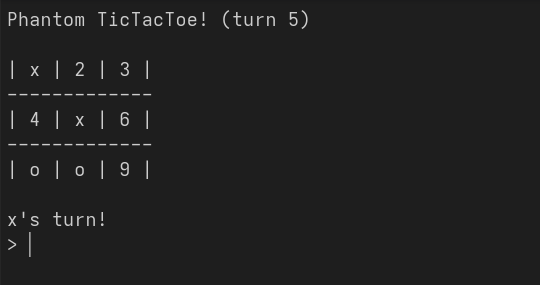

# Phantom TicTacToe

A tiny Phantom TicTacToe implementation in LuaJIT in the terminal!

> [!NOTE]
> This literally took 1 file and 200 lines lmao

# Showcase


# How to play?
## Gameplay
When you open the game, you'll see \<player>'s turn, with a > prompt.

You can either type an `index` (the numbers on the board) or a command.

Available commands are
- clear, cls -> clears the screen
- reset -> resets the game
- q, quit -> quits the game

## Game rules
Phantom TicTacToe is almost identical to the regular TicTacToe, the only difference is, there can only be 3 (three) marks on the board at a time. Once there are more, the first mark placed will dissapear!

# Running without installing
The game is written entirely in LuaJIT, so running is super easy.

First, we have to install LuaJIT and it's dependencies.
```bash
# Windows 10/11
winget install Git.Git DEVCOM.LuaJIT

# Ubuntu/Fedora
sudo apt/dnf install luajit git

# Arch/Manjaro
sudo pacman -S luajit git
```
<br>
Now, we can clone the repository and run the game.

```bash
git clone https://github.com/EveMeows/PhantomTicToe
cd PhantomTicToe

luajit ./main.lua
```

# Installing
If you want something more, like an executable, you can use core.c to create it.

```bash
# Linux

# Arch
sudo pacman -S luajit gcc xxd
# Fedora
sudo dnf install luajit-devel gcc xxd
# Ubuntu
sudo apt install libluajit-5.1-dev gcc xxd

# Convert main.lua into a C-readable bytearray.
xxd -i main.lua > main_lua.h

gcc -o phantom core.c main_lua.h -I/usr/include/luajit-2.1 -lluajit-5.1 -lm
sudo mv phantom /usr/local/bin
```

# License
GPL 3

